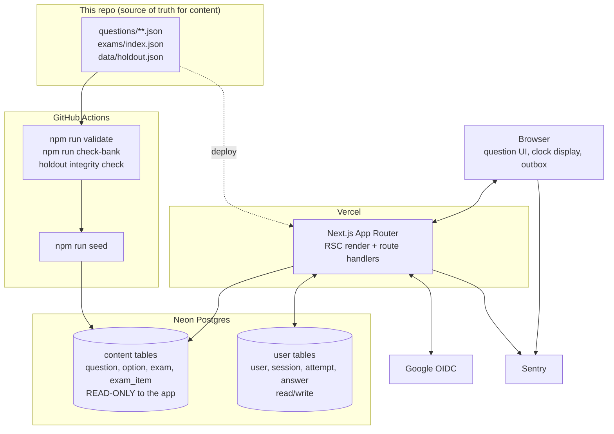

# Technical design & architecture — LFCA exam simulator

**Status:** approved, Phase 4, 2026-08-29
**How it's built.** Product: [02-product-requirements.md](02-product-requirements.md) ·
Schema: [04-database-schema.md](04-database-schema.md) ·
API: [07-api-design.md](07-api-design.md) · Decisions: [06-decision-log.md](06-decision-log.md)

---

## 1. The stack, and what was rejected

| Layer | Choice | Why this, not the alternative |
| --- | --- | --- |
| Framework | **Next.js, App Router** | One deployable holds UI and writes. Better Auth ships a first-class Next.js integration, so the auth half is configuration rather than plumbing. Server components mean the question bank — including the answer key — is read on the server and only the rendered stem and option text cross to the browser. *Rejected:* React Router 7 (equivalent shape, smaller auth-plus-Postgres ecosystem), a Vite SPA with a separate API (two deploy targets, hand-rolled browser sessions, and an API surface with no second consumer), SvelteKit (the design system and screen specs are written in React-shaped component language). |
| Language | **TypeScript, strict** | The question JSON has a real shape (§3). Typing it once at the seed boundary is what stops a malformed item reaching a render. |
| Data access | **Drizzle ORM** + `drizzle-kit` migrations | SQL-shaped and typed end to end; Better Auth has an official Drizzle adapter, so the auth tables are generated rather than hand-written. Migrations are plain readable SQL files. *Rejected:* Prisma (heavier serverless runtime, schema language that is not SQL), raw Kysely/`postgres.js` (Better Auth's table set becomes yours to migrate by hand). |
| Database | **Postgres** (Neon) | Decided in Phase 1 and not reopened. The honest case against SQLite is not scale — it is that this is one of two projects the owner keeps, it may open up later, and Neon's branch-per-preview costs nothing. See the decision log. |
| Auth | **Better Auth + Google OIDC**, email allowlist | Decided in Phase 1, overruled twice when deferral was proposed. See [08-auth-and-permissions.md](08-auth-and-permissions.md). |
| Styling | **Plain CSS**, `design/tokens.css` copied in verbatim | The design system is already expressed as custom properties. A utility framework would re-express values that are already pinned, which is exactly the drift [05-design-system.md](05-design-system.md) exists to prevent. No Tailwind, no CSS-in-JS. |
| Hosting | **Vercel** (app) + **Neon** (Postgres) | §10. |
| Errors | **Sentry** free tier + Vercel runtime logs | §9. |
| Tests | **Vitest** + one **Playwright** run | [11-testing-plan.md](11-testing-plan.md). |

---

## 2. Architecture



**What talks to what, and what happens when it is down.**

| Dependency | Used for | When it is down |
| --- | --- | --- |
| Neon Postgres | everything | The app is down. No offline mode, no degraded read path — an exam sitting without durable answers is worse than no sitting. The start screen shows the error state from doc 10; an in-progress attempt shows the "Not saved — retrying" chip (§7) and keeps accepting answers into the outbox. |
| Google OIDC | sign-in only | Existing sessions keep working — sessions are database-backed, not Google-backed. Only a fresh sign-in fails. Given a 30-day session (doc 08), a Google outage is very unlikely to interrupt a sitting. |
| Vercel | serving the app | The app is down. There is no failover and none is warranted. |
| Sentry | error reporting | Silent no-op. Sentry failing must never surface to the user or block a write; the SDK is configured to swallow its own transport errors. |

There are **no other third-party APIs.** The app makes no outbound calls during a sitting.

---

## 3. How the question bank reaches the app

The app is read-only over the bank (PRD X2). Content moves in one direction, at deploy time only.

```
questions/**/*.json ─┐
exams/index.json    ─┼─→ npm run validate ─→ npm run seed ─→ Postgres content tables
data/holdout.json   ─┘        (CI gate)        (idempotent)
```

**`npm run seed` is idempotent and destructive-in-place.** It truncates the four content tables and
reinserts inside one transaction. It never touches `user`, `attempt` or `answer`. Running it twice
produces the same database; running it on a bank that fails validation is impossible because CI
gates it.

**Question identity is the JSON `id` string** — e.g. `q.linux.command-line.command-syntax.01`. It is
the primary key in Postgres and the foreign key every answer points at. This means **renaming a
question id is a destructive act**: the seed's insert will fail against existing answer rows, which
is the intended alarm. Renumbering the bank and keeping history are mutually exclusive, and the
build fails loudly rather than orphaning answers silently.

### 3.1 The holdout is pinned by identity, and two guards keep it that way

PRD §5 requires the 40 holdout items to be defined **by identity**, so that a future
`npm run build-exams` cannot quietly promote one onto an exam. They were once derived —
`tools/build-exams.mjs` wrote `exams/index.json.unused` as *whatever the composition left over*, 40
ids that were correct but were a residue rather than a commitment. Two of the three steps below have
shipped; the third belongs to the seed and waits on `app/`.

1. **Done.** `data/holdout.json` pins the 40 ids as committed source.
2. **Done.** `tools/lib/holdout.mjs` is the single definition of "the holdout is intact", and two
   callers share it. `npm run validate` fails when the pin and `index.unused` stop agreeing as sets,
   so a build that puts a holdout item on an exam, or that leaves a 41st item unused, is a
   **validation failure**, not a warning. `npm run build-exams` calls the same function against the
   composition it has just computed and **refuses to write** — before its first write, leaving all
   sixty-three generated files exactly as they were. The failure therefore lands before the damage
   rather than after it, and the builder and the validator cannot hold a second opinion about what a
   violation is.
3. **Outstanding, with the seed.** The seed marks those 40 rows `is_holdout = true`. Every selection
   query in practice and domain mode filters `is_holdout = false` (PRD P2), and only the holdout
   sitting reads them.

The builder's allocation is deliberately **not** taught to build around the pin. Refusing is enough,
and teaching the composition to avoid the pinned ids would mean editing the most load-bearing code
in the repo to defend against an event the refusal already prevents.

### 3.2 Option order on the sixteen exams

`exams/index.json` records, per exam item, the **position of the correct option** on the generated
paper (0–3) — that is what `check-bank`'s answer-position-balance check reads. It does not record
the full option permutation; that exists only inside the rendered markdown.

**Decision:** store `correct_position` on `exam_item` and render an exam question by placing the
correct option at that index, with the three distractors in their authored relative order in the
remaining slots. This is deterministic, stable across re-sits, and preserves the answer-position
balance the bank was built to have.

**Accepted divergence:** the app's distractor ordering will not always byte-match
`exams/exam-07.md`. The correct answer's slot always matches. Nothing depends on the distractor
order, and parsing generated markdown to recover it would make the app depend on a rendering format
it should not know about.

In practice and domain mode there is no fixed paper, so options render in **authored order** —
`data` order, not shuffled. The bank's authoring already varies which option is correct.

---

## 4. Folder structure

The app lives in `app/` in this repo. Vercel's *Root Directory* is set to `app`. The existing root
scripts (`validate`, `generate`, `build-exams`, `check-bank`) stay exactly where they are.

```
lfca-lab/
├── data/ questions/ exams/ drills/ study-guide/ tools/   # unchanged — the bank
├── data/holdout.json                                     # NEW (§3.1)
├── docs/                                                 # planning docs
├── design/                                               # tokens.css + prototype build
└── app/                                                  # NEW — the simulator
    ├── package.json                # its own deps; root package.json untouched
    ├── drizzle.config.ts
    ├── src/
    │   ├── app/                    # Next.js App Router
    │   │   ├── (auth)/sign-in/
    │   │   ├── (app)/              # everything behind the session gate
    │   │   │   ├── page.tsx                    # home: three modes + holdout
    │   │   │   ├── exams/page.tsx              # E6 — the sixteen, best + first
    │   │   │   ├── attempt/[id]/page.tsx       # the sitting, all modes
    │   │   │   └── attempt/[id]/review/page.tsx
    │   │   └── api/                # route handlers — see doc 07
    │   ├── db/
    │   │   ├── schema.ts           # Drizzle tables — doc 04 is its spec
    │   │   ├── queries/            # selection, scoring, history
    │   │   └── migrations/
    │   ├── domain/                 # PURE, no I/O, no React — the tested core
    │   │   ├── weights.ts          # 18/11/10/8/7/6
    │   │   ├── select.ts           # weighted + unseen-first
    │   │   ├── score.ts            # n/60, pass at 45
    │   │   └── clock.ts            # remaining time from started_at
    │   ├── components/             # design-system components
    │   └── styles/tokens.css       # COPIED VERBATIM from design/tokens.css
    ├── scripts/seed.ts             # reads ../questions, ../exams, ../data
    └── tests/
        ├── unit/                   # Vitest over src/domain
        └── e2e/                    # one Playwright run
```

**`src/domain/` is the rule that keeps this testable.** Anything that decides a number — which
questions, in what order, what the score is, how much time is left — is a pure function there, taking
data and returning data. No database handle, no `Date.now()` (time is a parameter), no React. That
directory is what [11-testing-plan.md](11-testing-plan.md) covers exhaustively; everything else is
covered by one browser test and a manual checklist.

---

## 5. State management

| State | Lives | Notes |
| --- | --- | --- |
| Question content | **Postgres, read on the server** | Never fetched by the client. Server components render stem and options; `why` text and `correct` are excluded from the payload during a sitting (§9). |
| Attempt truth — answers, flags, start time | **Postgres** | The authority. Every write goes here. |
| Answer/flag optimistic echo | React state in the attempt client component | The UI updates the instant you click. The server write follows (§7). |
| Failed writes | In-memory outbox in the attempt component | §7. Deliberately not persisted — see the decision log. |
| Clock | **Derived, never stored as a countdown** | §6. |
| Session | Better Auth cookie + `session` table | Doc 08. |
| Theme | `localStorage`, with a no-JS-safe default | Only client state that outlives a page load. |

**No client data-fetching library.** No TanStack Query, no SWR, no Redux/Zustand. Reads are server
components; writes are route handlers called from a small typed `fetch` wrapper that owns the outbox.
Introducing a cache layer would create a second place attempt state can be stale, which is precisely
the bug class that loses a first-attempt score.

---

## 6. The clock is derived, never stored

`attempt.started_at` and `attempt.time_limit_seconds` are written once, at start. Remaining time is
always `time_limit_seconds - (now - started_at)`, computed **on the server** and sent to the client
as an absolute deadline timestamp. The browser counts down to that timestamp for display only.

This single decision answers three PRD edge cases at once:

- **Tab closed for 90 minutes (E5).** On return the server computes remaining ≤ 0, auto-submits the
  attempt as it stood, and redirects to review. There is no code path that extends a clock.
- **Two tabs on one attempt.** Both derive from the same `started_at`, so they cannot disagree.
  Later answer writes win; the upsert (§7) makes that safe.
- **Clock tampering.** Client time is display only. A user who changes their system clock changes
  what the countdown says and nothing about when the attempt closes.

**Auto-submit is lazy, not scheduled.** There is no cron and no background worker. An expired attempt
is finalised the next time it is touched — opened, answered against, or listed. An attempt can
therefore sit expired-but-unfinalised in the database indefinitely, which is correct: its score is
already fully determined by its answer rows. Practice and domain attempts have
`time_limit_seconds = null` and never expire.

---

## 7. Answer writes and the outbox

Every answer and flag is a **separate immediate write** (PRD E5: durable when made). The endpoint is
an **upsert keyed on `(attempt_id, question_id)`**, which makes every write idempotent and every
retry safe.

```
click option
  └─→ optimistic UI update (instant)
  └─→ POST /api/attempt/:id/answer
        ├─ 2xx  → done
        └─ fail → push to in-memory outbox
                    ├─ retry with exponential backoff (1s, 2s, 4s, 8s, capped 30s)
                    └─ while outbox non-empty: show "Not saved — retrying" chip
                       (doc 10 §4: incorrect-family, non-dismissible, never blocks
                        answering, never pauses the clock)
```

The outbox is a plain array in the attempt component's state. It is **not** persisted to
`localStorage` or IndexedDB: doc 10's contract is "at most the in-flight answer is lost", and a
durable outbox buys offline answering at the cost of replaying stale writes against an attempt the
server has already auto-submitted at 90 minutes. Rejected explicitly; see the decision log.

`beforeunload` warns if the outbox is non-empty. Submit is blocked while it is non-empty and the
Submit button shows its loading label (§8) — better to wait two seconds than to score an attempt
missing its last answer.

---

## 8. Error handling, and what the user sees

Three tiers, and the boundary between them is whether an exam is in progress.

| Situation | User sees | Logged |
| --- | --- | --- |
| Answer/flag write fails | The "Not saved — retrying" chip. Answering continues. Clock continues. | Sentry breadcrumb; an event only after 5 consecutive failures on one attempt, so a flaky tunnel does not spam. |
| Submit fails | Submit button returns to default, an inline message under it: *"Couldn't submit — your answers are saved. Try again."* Never a redirect to an error page mid-attempt. | Sentry event, always. |
| Page-level render/query failure outside an attempt | The screen's error state from doc 10, with a retry action. | Sentry event. |
| Unhandled exception anywhere | Next.js `error.tsx` boundary — a page in the design system's own styling, never a raw stack trace. `global-error.tsx` as the last resort. | Sentry event with the user id. |
| Requested attempt is not yours / does not exist | 404, worded as not-found. Never "forbidden" — that confirms the row exists. | Warn-level log only. |

**Button loading state** (the item [05-design-system.md](05-design-system.md) §7.2 deferred to this
phase): the button takes the **existing disabled tokens** and its **label changes** — "Submit and see
score" → "Scoring…", "Start exam" → "Starting…", "Continue with Google" → "Signing in…". No spinner,
no icon slot, no animation. The design system has no animated primitive and this is not the place to
introduce its first one. It applies in exactly three places: sign-in, start-attempt, submit.

---

## 9. Security baseline

*Mandatory section. Answered concretely, including the parts that are uncomfortable.*

**Where secrets live.** Vercel environment variables, per environment (Production / Preview /
Development), and `app/.env.local` locally — gitignored, with `app/.env.example` committed carrying
names and empty values only. Nothing secret is ever committed. Full inventory in
[12-deployment.md](12-deployment.md). The Google client secret, the Neon connection string, the
Better Auth secret and the Sentry auth token are the four that matter.

**Input validation.** Every route handler validates its body with a **Zod schema at the server
boundary** before anything else runs; client-side validation exists only to make the UI pleasant and
is never trusted. The app's actual input surface is tiny and worth stating exactly, because it is the
whole attack surface:

- `attempt_id` — a UUID, and **ownership is re-checked against the session on every request**. This
  is the single most important check in the app: without it, `/api/attempt/<someone-else's-id>/answer`
  writes to another user's attempt.
- `question_id` — must belong to the attempt. Not "must exist" — *must be one of this attempt's
  questions*. Otherwise an attempt can be padded with answers to questions it never asked.
- `option_ref` — must be one of that question's four refs.
- `mode`, `domain`, `length` on start — enums and a fixed set `{20, 40, all}`. Never free integers.

Drizzle parameterises every query; no string-concatenated SQL anywhere.

**HTTPS.** Vercel terminates TLS and issues certificates; HTTP is redirected. Neon requires TLS on
the connection string (`sslmode=require`). There is no local-only service exposed to the internet.
Cookies are `Secure`, `HttpOnly`, `SameSite=Lax`.

**Sensitive data.** Deliberately minimal: an email address, a display name, a Google avatar URL, an
OAuth refresh token, and study history. No passwords are ever stored — Google holds the credential.
Emails and tokens are **excluded from logs and from Sentry** via `beforeSend` scrubbing; Sentry is
configured with `sendDefaultPii: false` and identifies users by database id, not email. Neon
encrypts at rest. Application-level column encryption is **not** used: it would protect against a
threat (a stolen Neon snapshot) that also yields the key, and would make every query worse.

**Dependency updates.** **Dependabot**, weekly, grouped, on `app/package.json`. Security advisories
open immediately. Patch and minor updates are merged once CI is green; majors are read first. The
named manual cadence for anything Dependabot cannot do: a `npm audit` and a Next.js release-note read
on the first weekend of each month, for as long as the app is in use.

**The single worst thing an attacker could do, and what stops it.**

Not data theft — the data is publicly-derived study material and one email address. The worst
realistic outcome is **corrupting or deleting the owner's attempt history**, which destroys the only
irreplaceable thing here: the first-attempt scores, which by definition cannot be regenerated.
Stopping it rests on three layers, in order of importance:

1. **The email allowlist** (doc 08) — an unrecognised Google account is rejected at the OAuth
   callback and no user row is created. Without this, deploying is publishing.
2. **Ownership checks on every attempt-scoped query**, not just at the page level. Enforced by
   routing every such query through helpers in `src/db/queries/` that take a session and refuse to
   compile a query without one.
3. **Nightly Neon backups with a tested restore** (doc 12) — because the second-worst actor here is
   a bad migration written by the owner, and it is far more likely than an attacker.

Rate limiting is deliberately absent in v1. It is unnecessary behind an allowlist of one, and is the
first thing to add if sign-up opens.

---

## 10. Hosting and cost

| | Vercel | Neon | Sentry | Total |
| --- | --- | --- | --- | --- |
| 0 users | Hobby, $0 | Free tier, $0 | Developer tier, $0 | **$0/mo** |
| 1 user (real) | $0 | $0 | $0 | **$0/mo** |
| ~1,000 users | Pro tier — Hobby is non-commercial and this traffic invites a review | A paid tier for storage and compute hours | Likely still free at this volume | **≈ $20–40/mo** |

*Plan names and prices as understood at planning time (2026-08-29). Verify at signup rather than
trusting this table — provider pricing moves.*

The first thing that breaks under load is not compute; it is **Neon's free-tier connection and
compute-hour ceiling**, and the fix is a paid Neon tier, not an architecture change. Nothing here
needs to change shape until well past the point this project would have a reason to.

---

## 11. The three hardest problems

**1. Correctness of the numbers, when there is no oracle.**
The whole product is a scoreboard. A silently wrong score — off-by-one on the pass mark, a
first-attempt flag set twice, a weighted selection that quietly returns 59 questions — is worse than
a crash, because it is believed. There is no external system to reconcile against.
*Plan:* everything that produces a number lives in `src/domain/` as a pure function with no I/O, and
is unit-tested against the facts already measured in this repo — the 18/11/10/8/7/6 split, 45/60,
960 distinct exam items, 40 holdout. Property-style tests assert the invariants rather than examples:
a weighted set is always exactly 60, always matches the weights, never contains a holdout item, never
repeats a question within one sitting. Scoring is tested at the boundary — 44, 45, 46.

**2. The interrupted attempt.**
The resume path (E5) crosses more state than anything else in the app: an attempt with partial
answers, a clock that ran while nobody watched, and an auto-submit that may already be due.
*Plan:* §6 removes most of the difficulty by making the clock derived rather than stored. The rest is
handled at the database: finalisation is a conditional update (`SET submitted_at = now() WHERE id = $1
AND submitted_at IS NULL`) whose row count tells the caller whether it was the one that submitted —
so a double submit scores once and the loser simply reads the result. `is_first_attempt` is kept out
of this entirely: it is set when the attempt is *created* (doc 04 §5.2), so an abandoned first
sitting keeps the flag no matter which attempt is finalised first. This is the path the single
Playwright test covers end to end.

**3. Keeping the app and the bank honest about the holdout.**
The holdout is the project's only defence against its riskiest assumption, and it once depended on a
derived list (§3.1) that an ordinary, well-intentioned `npm run build-exams` could void.
*Plan:* pin it in `data/holdout.json`, assert set-equality with `index.unused` in `npm run validate`,
refuse the build itself on the same comparison, carry `is_holdout` into Postgres, and filter on it in
every selection query rather than trusting the seed. The first three have shipped; the last two
arrive with the seed. Three independent places would have to fail together for a holdout item to be
served early.
